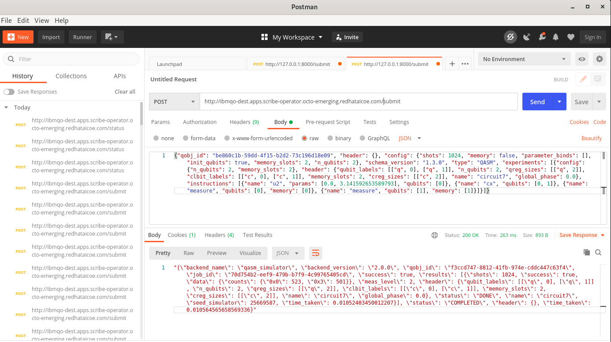
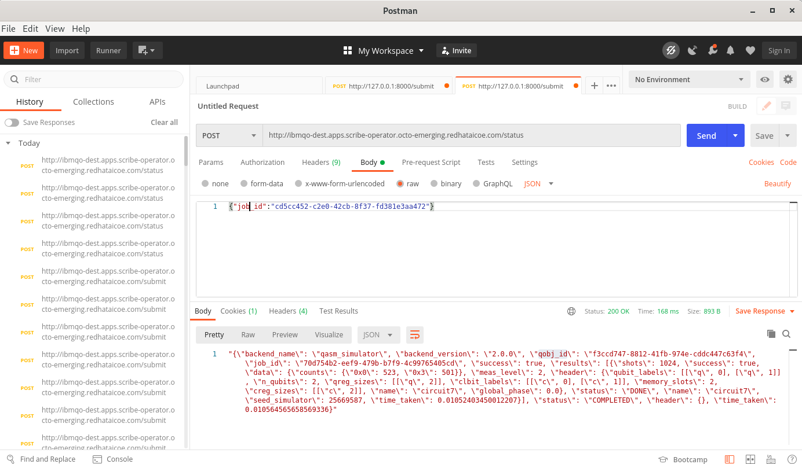

# Getting started

This documents explains the steps to interact with the Asynchronous Job Framework (AJF).


## REST Endpoints

``` bash
    {$URL}/submit
    {$URL}/status

```

### Submit

To submit a circuit use `/submit` endpoint. Provide the qiskit object as body of request. Using a tool like [Postman](https://www.postman.com/use-cases/api-first-development/) can be helpful.

You can either create a qiskit object by:

- Following [Qiskit IBM Quantum Schema](https://github.com/Qiskit/ibm-quantum-schemas) See example [here](https://github.com/Qiskit/ibm-quantum-schemas/blob/main/schemas/examples/qobj_openqasm_example.json)

- Using `assemble`

``` python
from qiskit import BasicAer
from qiskit import QuantumCircuit
from qiskit import transpile, assemble
from qiskit.qobj.qasm_qobj import QasmQobj as QasmQobj

import pickle
import json
import numpy


class QobjEncoder(json.JSONEncoder):
    def default(self, obj):
        if isinstance(obj, numpy.int32):
            return obj.item()
        if isinstance(obj, numpy.ndarray):
            return obj.tolist()
        if isinstance(obj, complex):
            return (obj.real, obj.imag)
        return json.JSONEncoder.default(self, obj)

# Create sample circuit
qc = QuantumCircuit(2, 2)
qc.h(0)
qc.cx(0, 1)
qc.measure([0, 1], [0, 1])
backend_sim = BasicAer.get_backend('qasm_simulator')
transpiled_qc = transpile(qc, backend_sim)

# Get qobject
qasm_obj = assemble(transpiled_qc)


qasm_obj_dic = qasm_obj.to_dict([True])
# Convert qasm_obj_dic to json for sending over
qasm_obj_json = json.dumps(qasm_obj_dic, cls=QobjEncoder)
print(qasm_obj_json)
```

Use the printed `qasm_obj_json` as request body



Capture the response. Use `job_id` to query about job status.

``` json
{
    "backend_name ": "qasm_simulator ",
    "backend_version ": "2.0.0 ",
    "qobj_id ": "f3ccd747-8812-41fb-974e-cddc447c63f4 ",
    "job_id ": "70d754b2-eef9-479b-b7f9-4c99765405cd ",
    "success ": true,
    "results ": [
        {
            "shots ": 1024,
            "success ": true,
            "data ": {
                "counts ": {
                    "0x0 ": 523,
                    "0x3 ": 501
                }
            },
            "meas_level ": 2,
            "header ": {
                "qubit_labels ": [
                    [
                        "q ",
                        0
                    ],
                    [
                        "q ",
                        1
                    ]
                ],
                "n_qubits ": 2,
                "qreg_sizes ": [
                    [
                        "q ",
                        2
                    ]
                ],
                "clbit_labels ": [
                    [
                        "c ",
                        0
                    ],
                    [
                        "c ",
                        1
                    ]
                ],
                "memory_slots ": 2,
                "creg_sizes ": [
                    [
                        "c ",
                        2
                    ]
                ],
                "name ": "circuit7 ",
                "global_phase ": 0
            },
            "status ": "DONE ",
            "name ": "circuit7 ",
            "seed_simulator ": 25669587,
            "time_taken ": 0.01052403450012207
        }
    ],
    "status ": "COMPLETED ",
    "header ": {},
    "time_taken ": 0.010564565658569336
}
```

### Status

To query the status of a previously submited job use `job-id` from the response from step 1.
e.g. `"job_id": "70d754b2-eef9-479b-b7f9-4c99765405cd"`


